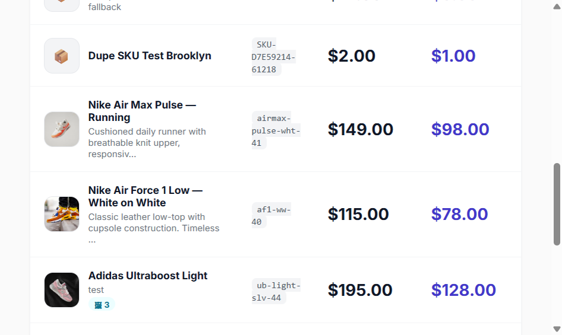
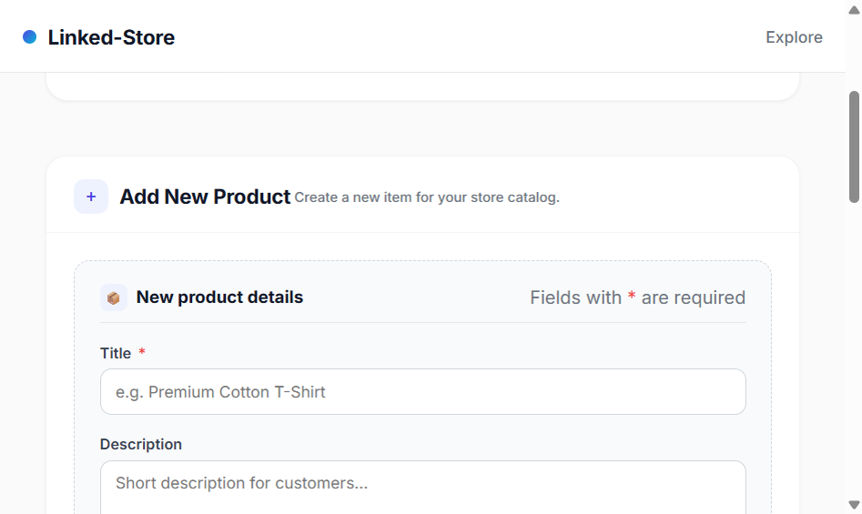
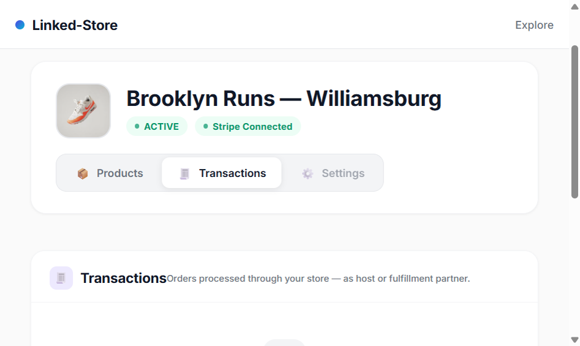

# Linked-Store User Guide

Hyperlocal omnichannel retail network — shoppers browse, reserve, and check out with split-ledger Stripe Connect payments between a **Host store** (originator earning margin) and a **Neighbor / Fulfillment store** (earns wholesale). Pickup secured via QR-code plus 8-digit numeric fallback. Store operators manage their own isolated admin dashboards; one **Global Admin** oversees every store.

---

## 1. Quick Start — Run the application

### URLs (default development)
| Role | URL |
|---|---|
| Frontend customer UI | `http://127.0.0.1:4200` (LAN: `http://192.168.178.114:4200`) |
| Backend REST API | `http://127.0.0.1:8080/api` |
| Global Admin login | `http://127.0.0.1:4200/login` → credentials below |

### Default credentials (seeded on first start)
| User | Email | Password | Access |
|---|---|---|---|
| **Global Admin** | `admin@linked.store` | `Admin123!` | All stores, all users, all transactions, create stores, promote global admins |
| — | Sign up at `/signup` | choose your own | Creates a store + store-admin user who sees only *their* store |

### Start backend
```powershell
cd backend
.\__run_with_env.bat spring-boot:run
```
(The wrapper calls `setup.bat` first — which exports all `LINKEDSTORE_AUTH_*`, Stripe, DB, and R2 env vars literally — then invokes Maven.)

### Start frontend
```powershell
cd frontend
ng serve --host 127.0.0.1 --host 192.168.178.114 --port 4200
```

### Data / Schema
- PostgreSQL: `localhost:5432/linked_store`, user `postgres` / password `postgres`.
- Hibernate `ddl-auto=update` adds columns; `ProductCatalogSeeder` also applies one-off DDL (`ALTER … DROP NOT NULL`, unique email index) and seeds the global admin from the env vars on first start.
- User table is **`store_users`** (reused from earlier schema; now contains columns `password_salt`, `password_hash`, `role`, `is_global_admin`, `refresh_token_hash`, etc.).
- Passwords: PBKDF2-HMAC-SHA512, 310 000 iterations, 32 B salt, 64 B hash (columns `password_salt` + `password_hash`, format `ITER$SALT$B64HASH`), constant-time verify.
- JWT: HS512 dual-token. Access tokens 30 min (stateless). Refresh tokens 7 d (stored SHA-256 hashed, rotated on each use, revoked on logout). Claims `token_type ∈ {access, refresh}` are *enforced at parse time* so an access token can never double as a refresh token.

---

## 2. Customer Flow — Browse → Reserve → Pay → Pick up

### Step 1. Explore the map / QR directory (Home)
Landing page shows stores nearby as QR codes — scan or tap to enter a store:


### Step 2. Product detail page — "Request Now" countdown
Tap any product. You'll see a countdown timer, images, and a **Request Now** button that locks the current neighbor price for a short reservation window:


### Step 3. Checkout — Split-ledger overview
The checkout page clearly shows the Host (originator margin) vs Neighbor (fulfillment, wholesale) split, total, and both **QR-code pickup** and **8-digit numeric fallback** codes:


### Step 4. Pay (Stripe hosted checkout)
Clicking **Pay** redirects you to a Stripe hosted checkout session:


After successful payment you return to a success page:


> Internally the split-ledger is applied: the **neighbor store's Stripe Connect** account receives the wholesale amount *declaratively* via `SessionCreateParams.destination`, and the **host store** receives their margin via a `Transfer.create` after pickup is verified (fallback safe-bytes pattern if capabilities are missing: amounts embedded in metadata and two explicit `Transfer.create` are issued post-pickup). Platform commission = 0 %.

### Step 5. Merchant pickup — QR (secure) or 8-digit code (fallback)
The staff member at the fulfillment store opens the merchant pickup page. They can either **scan the shopper's QR code** (primary, cryptographically signed pickup token), or the shopper can read their **8-digit numeric code**:


After either input succeeds the merchant sees a green settled confirmation:


The **fallback 8-digit code path** (anti-replay protected, one-time, server-verified without the QR signature) returns a verified result identical to the QR path:


---

## 3. Merchant — Stripe Connect Onboarding
Before a store can receive split-ledger payouts its owner must complete Stripe Express onboarding. As a **store admin** log in, navigate to the store dashboard, and complete onboarding. As Global Admin you can see onboarding status per store (column **Onboarded** on the admin Stores tab).


---

## 4. Store Sign-up — Become a Store Admin
Go to **`/signup`** (accessible from the footer of the Log in page). The sign-up form has **two sections**: user credentials and store information, with the **`Login as admin for this store`** checkbox (ticked by default — this grants you `STORE_ADMIN` on the freshly created store):


### Fields

**User info**
| Field | Required? | Notes |
|---|---|---|
| Email | ✅ | Unique, used as login |
| Password | ✅ | Min 8 chars; stored PBKDF2 salted + hashed |
| Full name | ✅ | Displayed in admin |
| Phone | ❌ | Contact |

**Store info**
| Field | Required? | Notes |
|---|---|---|
| Business name | ✅ | Displayed everywhere |
| Latitude | ✅ | Numeric, used for map |
| Longitude | ✅ | Numeric, used for map |
| Logo URL | ❌ | Any https image |
| **Login as admin for this store** | ✅ (checkbox) | If checked your role becomes **STORE_ADMIN** and you see the store's private dashboard |

Click **Sign up**. If **Login as admin** was checked you are **immediately issued a JWT pair** (access + refresh) and auto-redirected to **`/admin`** where you see **only your own store**:


> **Data isolation is absolute.** A store admin (or any store user) will never see users, stores, or transactions belonging to another store. Every list query is WHERE-filtered by `store_id`, additionally guarded by role-rank checks in `AuthenticationFacade`, and the Spring Security route matcher further restricts `/api/admin/stores/**` to `ROLE_GLOBAL_ADMIN` only.

---

## 5. Log in

Navigate to **`/login`**:


Enter credentials. After successful login:
- If your role is **GLOBAL_ADMIN**, **STORE_ADMIN**, or **OWNER** → you land on `/admin`.
- Otherwise (CLERK, RUNNER) → you land on the home page and can use `/fulfillment/**` and `/inventory/**` endpoints.

---

## 6. Admin Dashboard — Three Tabs

The `/admin` page exposes three tabs: **Stores**, **Users**, **Transactions**. What you see depends on your role.

### 6.1 Stores tab

| Role | View |
|---|---|
| **GLOBAL_ADMIN** | Full CRUD table: **All stores** listed with ID, Name, Lat, Lng, Onboarded, Subscription, Users count, Tx count, Edit + Suspend actions per row |
| **STORE_ADMIN / OWNER** | Single card: **Only your store**. No Edit/Suspend on stores. |

Global Admin view (7 stores seeded from prior runs):


### 6.2 Users tab — Manage store operators

| Role | View |
|---|---|
| **GLOBAL_ADMIN** | Every user across every store. Can create users with any role in any store. Can promote `isGlobalAdmin=true` to create additional super-admins. |
| **STORE_ADMIN / OWNER** | Only users of *their* store. They can create additional **CLERK**, **RUNNER**, or fellow **STORE_ADMIN / OWNER** operators — still scoped to the same store. |

Click the **`+ Add user`** expandable card to open the create-user form:


Available **Roles** (enforced rank in `AuthenticationFacade.requireAtLeastRole(...)`):

| Role | Rank | Permissions |
|---|---|---|
| `GLOBAL_ADMIN` | 100 | Everything (cross-store) |
| `OWNER` | 50 | Full admin, but scoped to their own store |
| `STORE_ADMIN` | 45 | Same as OWNER for CRUD users/tx in their store |
| `CLERK` | 20 | Can run checkout/pickup operations |
| `RUNNER` | 10 | Inventory + fulfillment endpoints only |

For each user row you can click **Suspend** to soft-flip status `ACTIVE ↔ SUSPENDED` (soft delete uses `UserStatus.DELETED` similarly). Passwords are required when creating a user with `CreateUserRequest.password` — otherwise the user is created with status **INVITED** and can reset their password later.

### 6.3 Transactions tab — Scoped ledger

Every transaction visible on this tab is already scope-filtered:
- **GLOBAL_ADMIN** sees every transaction (across every store)
- **STORE_ADMIN / OWNER** sees only transactions involving their store

Pagination controls at the bottom: **Prev / Next**. An empty starting state for a fresh store looks like this:


Columns shown in the table: **ID, Stores (Host ⇄ Neighbor), Status, Total, Created**. Rows are color-coded by status: green = completed/paid/settled, amber = pending/processing/hold, red = failed/cancelled/refund, blue = anything else.

---

## 7. Store-Scoped Admin Dashboard — Products, Gallery Uploads, Transactions

When you log in as a **store admin** (or click the **🏬 Store Admin** button on a store row as Global Admin) you enter the store-scoped dashboard, routed under **`/admin/stores/{storeId}`** (or `/admin/stores/me/products` to auto-pick your own store). There are **no modals** — every action is its own page.

### 7.1 Entry point — where to find it

| As … | Where |
|---|---|
| STORE_ADMIN or OWNER | After login you land on `/admin`. Your store card shows a **🏬 Store Dashboard** link → opens `/admin/stores/me/products`. |
| GLOBAL_ADMIN | `/admin` → Stores tab → every row has a **🏬 Store Admin** action → opens that store's dashboard. |


### 7.2 Tab 1 — 📦 Products & Inventory

The default child route lists every product **variant** in your store (one row per size/color/SKU), with a cyan **🖼 N** pill that shows how many unique gallery images the product has (deduped across platform-level gallery + variant gallery):



**Columns** — Product (cover image + title + short description + 🖼 chip), SKU, Retail $, Wholesale $, Stock (or blank if the variant doesn't track stock), Status (ACTIVE / DRAFT / ARCHIVED color-coded).
Actions — **✎ Edit** on each row → opens the edit routed page; **＋ Add product** in the header → creates a new product.

### 7.3 Add / Edit a product (cover image + gallery)

All routed as real URLs (no modals):

| Action | Route |
|---|---|
| New product | `/admin/stores/{storeId}/products/new` |
| Edit variant | `/admin/stores/{storeId}/products/{variantId}` |



**Fields**

| Group | Field | Required? | Notes |
|---|---|---|---|
| Basic | Title | ✅ | Free text |
| Basic | Description | ❌ | Multi-line, shown on the customer PDP |
| 🖼 Cover image | Upload dropzone OR paste URL | ❌ | 220×220 preview; drag & drop; max 20 MB; JPG / PNG / WebP / GIF / AVIF |
| 🖼 Gallery | Add images dropzone | ❌ | Multi-select; per-tile progress bar + cancel; dedupes at save |
| Fulfillment | SKU | ❌ | Left blank → auto-assigned deterministic `SKU-{store8hex}-{time6hex}` at backend |
| Fulfillment | Status | ✅ | 🟢 ACTIVE · 🟡 DRAFT · ⚪ ARCHIVED |
| Pricing | Wholesale price ($) | ✅ | What the fulfillment store earns |
| Pricing | Retail price ($) | ✅ | What the host store charges customers |
| Stock | Stock quantity | ✅ | Non-negative (Postgres `chk_positive_stock` enforces this) |

#### How image uploads work

1. Before the product is saved (no ID yet) images are uploaded to a **pending** folder in Cloudflare R2: `stores/{storeId}/uploads/pending/products/yyyy/MM/dd/{nonce}_{name}.{ext}` (or `pending/variants/…`).
2. Uploads use the existing `ImageStorageService` / `ImageController` (`POST /api/images/upload`, scope `pending_product` or `pending_variant`), with your Bearer JWT.
3. The form shows a progress bar on each tile (cover shows an overlay spinner; each gallery tile shows its own % bar + Uploading tag).
4. On **Create product** the public URLs are POSTed as plain string arrays: `productGalleryImageUrls: string[]` and `variantGalleryImageUrls: string[]` in the JSON body, persisted straight into two PostgreSQL **JSONB** columns (`products.gallery_image_urls`, `product_variants.gallery_image_urls`).
5. In the list, 🖼 = size of `Set(productGallery ∪ variantGallery)`.

> **Tip — blank SKU? Don't worry.** The SKU field is optional on purpose. If you don't fill it in, the backend generates a collision-safe placeholder (e.g. `SKU-D7E59214-61218`) so catalog search / barcodes still work. Because uniqueness is scoped per store, two different stores can both use `TSHIRT-001` as their SKU without colliding.

### 7.4 Tab 2 — 🧾 Transactions

Scoped to this store only: `/admin/stores/{storeId}/transactions`. Every reservation / payment this store has participated in — **either as Host (originator earning the margin) or as Neighbor / Fulfillment store (earning the wholesale)**.



Status color coding matches the Global Admin Transactions tab (green = completed/paid/settled, amber = pending/processing/hold, red = failed/cancelled/refund). As customers check out, rows are added with columns **ID, Stores (Host ⇄ Neighbor), Status, Total, Created**.

---

## 8. Authentication Deep Dive — How JWT, refresh, and logout behave

| Action | What happens |
|---|---|
| Register (as admin) or Login | Issues `accessToken` (30 min, Bearer) + `refreshToken` (7 d). Refresh token is **hashed with SHA-256, BASE64 no-padding** and saved in column `refresh_token_hash` (not the raw token) — a DB dump cannot impersonate users. Tokens stored in browser `localStorage` keys `ls.access_token`, `ls.refresh_token`, `ls.current_user`. |
| Request to `/api/**` | `auth.interceptor.ts` injects `Authorization: Bearer <access>`. If access is still valid → request proceeds. If server returns **401**, the interceptor calls `/api/auth/refresh` and retries the original request once. Concurrent 401s are queued onto a single refresh `BehaviorSubject` so refresh is called only once. |
| `/api/auth/refresh` (server) | (1) Parses refresh JWT as `token_type=refresh` (anything else → rejected). (2) Loads user row → SHA-256 re-hashes presented refresh → constant-time compares to `refresh_token_hash`. (3) **Rotates** the pair: issues a *brand new* access+refresh and overwrites the hash. The old refresh is now dead — replaying it → 401. |
| `/api/auth/logout` | Sets `refresh_token_hash = NULL` on the row (server-side). The user's refresh is instantly revoked. Their 30-min access token remains valid for its natural lifetime (standard JWT statelessness). When it expires, no new access can be minted. To implement *instant* access invalidation add a `token_version` column + claim check (TBD enhancement). |

**Roles** inside the JWT claims — every access token carries: `sub` (userId), `email`, `store_id` (null for GLOBAL_ADMIN without a store), `role`, `is_global_admin`, `token_type=access`. This removes round-trips to the DB on every request:

```
JwtAuthenticationFilter → CurrentUser principal → SecurityContext
 → AuthenticationFacade.requireGlobalAdmin / requireStoreAdminOrOwner(storeId)
 → ROLE_<ROLE> authorities checked by @PreAuthorize and route matchers
```

Triple belt-and-suspenders for data isolation:
1. **Route matcher** (SecurityConfig) → e.g. `/api/admin/stores/**` requires `ROLE_GLOBAL_ADMIN`.
2. **Facade method-level** (controllers call `facade.requireStoreAdminOrOwner(targetStoreId)` before the query).
3. **Repository WHERE** (e.g. `findByStoreId(...)`, `JpaSpecificationExecutor` with `visibleTransactionIds(storeId)` spec).

---

## 8. REST Endpoints Quick Reference

### Auth — `/api/auth/**` (public)
| Method | Path | Input | Returns |
|---|---|---|---|
| POST | `/register` | `{email, password, fullName, phone, businessName, lat, lng, logoUrl, isStoreAdmin}` | `AuthTokenResponse` (access+refresh+user) |
| POST | `/login` | `{email, password}` | `AuthTokenResponse` |
| POST | `/refresh` | `{refreshToken}` | `AuthTokenResponse` (newly rotated) |
| POST | `/logout` | (body empty, need Bearer access) | `204 No Content` (hash nullified) |
| GET | `/me` | Bearer | `CurrentUserResponse` (id,email,role,storeId,isGlobalAdmin,…) |

### Admin — Stores — `/api/admin/stores/**` — **GLOBAL_ADMIN only**
| Method | Path |
|---|---|
| GET | `/` → list stores with user/tx counts |
| POST | `/` → create a store (CreateStoreRequest) |
| PUT | `/{id}` → update store incl. `SubscriptionStatus` |
| DELETE | `/{id}` → soft cancel subscription (CANCELED) |

### Admin — Users — `/api/admin/users/**` — GLOBAL_ADMIN (cross-store) OR STORE_ADMIN/OWNER (scoped)
| Method | Path | Scope behavior |
|---|---|---|
| GET | `/` | Global → all; Store admin → only their storeId |
| POST | `/` | `role ∈ {GLOBAL_ADMIN→only-promotable-by-global, STORE_ADMIN, OWNER, CLERK, RUNNER}`; Global admin can assign any `storeId`; Store admin auto-fills their own `storeId` |
| PUT | `/{id}` | Update name/phone/role/password/status |
| DELETE | `/{id}` | Soft delete (status DELETED, clear refresh hash) |

### Admin — Transactions — `/api/admin/transactions/**` — same scope as users
| Method | Path |
|---|---|
| GET | `/` → query params `page`, `pageSize`, `status`, `storeId`, `from`, `to` |
| Response | `{page, pageSize, totalCount, totalPages, items[...]}` |

### Store-Scoped Inventory — `/api/admin/stores/{storeId}/inventory/**`
Requires at least `STORE_ADMIN` for the target store (or GLOBAL_ADMIN). `{storeId}` may be `me` for the logged-in store admin.

| Method | Path | Purpose |
|---|---|---|
| GET | `/` | List product variants for the store (cover image + gallery JSONB counts) |
| GET | `/{variantId}` | Single variant detail (edit form prefill) |
| POST | `/` | Create product + variant. Body: `StoreInventoryListingRequest` (incl. `productGalleryImageUrls[]`, `variantGalleryImageUrls[]`) |
| PUT | `/{variantId}` | Update product + variant (dirty-checks title/description/imageUrls + sku/pricing/stock) |
| DELETE | `/{variantId}` | Archive variant (sets status ARCHIVED) |

### Store-Scoped Transactions — `/api/admin/stores/{storeId}/transactions/**`
| Method | Path | Purpose |
|---|---|---|
| GET | `/` | Transactions where `hostStoreId = storeId` OR `fulfillmentStoreId = storeId` (paginated, same query params as global) |

### Image Upload — `/api/images/**` (Bearer JWT + upload scopes)
| Method | Path | Purpose |
|---|---|---|
| GET | `/config` | Returns `{ maxBytes, allowedContentTypes[], supportedScopes[] }` — scopes incl. `product`, `variant`, `store_logo`, `pending_product`, `pending_variant` |
| POST | `/upload` multipart/form-data (fields: `file`, `scope`, `store_id`) | Generic upload to R2. `pending_product` / `pending_variant` scopes do not require an existing product/variant id — safe for `/new` form pre-save uploads |
| POST | `/product` multipart/form-data (`file`, `store_id`, `product_id`) | Typed alias — places into `stores/{id}/products/{pid}/…` |
| POST | `/variant` multipart/form-data (`file`, `store_id`, `variant_id`) | Typed alias — places into `stores/{id}/variants/{vid}/…` |
| POST | `/store-logo` multipart/form-data (`file`, `store_id`) | Logo alias — places into `stores/{id}/logo/…` |
| POST | `/pending-product` multipart/form-data (`file`, `store_id`) | Pending scope for Add-product form — `stores/{id}/uploads/pending/products/yyyy/MM/dd/…` |
| POST | `/pending-variant` multipart/form-data (`file`, `store_id`) | Pending scope for Add-variant form — `stores/{id}/uploads/pending/variants/yyyy/MM/dd/…` |
| DELETE | `/delete` (JSON: `{ objectKey }`) | Hard-delete from R2 bucket |

Plus the prior e-commerce controllers: reservations, checkout, pickup verify, Stripe sessions/pay, Connect onboarding, inventory availability (see prior phases).

---

## 9. Troubleshooting

| Symptom | Cause / Fix |
|---|---|
| Sign up button stays disabled | Form invalid. Email format + password min 8 chars + fullName + businessName + lat/lng numbers. The button becomes enabled as soon as `signupForm.valid` is true (dispatch `input` + `change` events if scripting). |
| 403 on `/admin/stores` as store admin | **By design.** Only GLOBAL_ADMIN can list all stores. Store admins see a single store card in the same tab. |
| Login returns 401 after signup | DB uniqueness? Check the user row exists via psql. Remember: password is PBKDF2 (NOT plain/BCrypt). Compare columns `password_salt` + `password_hash` populated. |
| Refresh rotation always 401 "Invalid refresh token" | (Fixed in this build.) If you see it after a schema migration: a `refresh_token_hash` was saved with a different algo than the verify path uses. Re-login to mint a fresh pair. |
| Transaction tab 500 / error path `/transactions` not `/admin/transactions` | (Fixed.) Upgrade frontend to latest — it now hits `/api/admin/transactions`. |
| PSQL "password authentication failed" from CLI | psql.exe prompts interactively unless you set `$env:PGPASSWORD='postgres'` in the same PowerShell scope. `psql` is not on PATH; use the absolute binary at `C:\Program Files\PostgreSQL\16\bin\psql.exe`. |
| Frontend `resolveApiBasePublic()` returns wrong origin | Check `frontend/src/index.html` line `window.__API_BASE_ORIGIN__`. In dev it is pinned to `http://192.168.178.114:8080`. Update both IPs if your LAN address changes. |
| Build warnings `Module 'qrcode' is not ESM` | Harmless — angularx-qrcode pulls CommonJS. Build still produces valid bundles. |
| **"Network error during upload."** when adding product cover/gallery | 99 % = backend not running on port 8080. Start backend with `cd backend; .\__run_with_env.bat`; message ends with `· Check backend is running (origin)`. Also check CORS preflight: OPTIONS to `/api/images/upload` with `Origin=4200` must return 200 + `Access-Control-Allow-Credentials: true`. |
| **"A database constraint was violated. Please check your input."** when saving a product (after fixes, message now ends with `Constraint: …`) | (a) If you see **Constraint: uk_product_variants_store_sku** → you typed a SKU that already exists in this store — change it or leave blank (auto-assigns a unique fallback). (b) If the constraint name is **chk_positive_stock** → Stock quantity cannot be negative. (c) If you still see "constraint was violated" WITHOUT a constraint name → your build predates the GlobalExceptionHandler extractor; upgrade backend. For legacy DBs with old schema drift: Hibernate `ddl-auto=update` never drops old constraints/columns; fix once via psql: `ALTER TABLE product_variants DROP CONSTRAINT IF EXISTS ukq935p2d1pbjm39n0063ghnfgn; ALTER TABLE product_variants ALTER COLUMN sku DROP NOT NULL;` — then restart backend. |

---

## 10. Permissions Cheat Sheet — one picture

| Endpoint / Action | GLOBAL_ADMIN | OWNER | STORE_ADMIN | CLERK | RUNNER | Public |
|---|---|---|---|---|---|---|
| `/api/auth/register` / `/login` | ✅ | ✅ | ✅ | ✅ | ✅ | ✅ |
| `/api/admin/stores` list/create/update/delete | ✅ | ❌ | ❌ | ❌ | ❌ | ❌ |
| `/api/admin/users` list scoped | ✅ (all) | ✅ (theirs) | ✅ (theirs) | ❌ | ❌ | ❌ |
| `/api/admin/users` create CLERK/RUNNER | ✅ | ✅ | ✅ | ❌ | ❌ | ❌ |
| `/api/admin/users` promote GLOBAL_ADMIN | ✅ only | ❌ | ❌ | ❌ | ❌ | ❌ |
| `/api/admin/transactions` (global) | ✅ (all) | ✅ (theirs) | ✅ (theirs) | ❌ | ❌ | ❌ |
| `/api/admin/stores/{id}/inventory/**` product CRUD + gallery | ✅ | ✅ | ✅ | ❌ | ❌ | ❌ |
| `/api/admin/stores/{id}/transactions` store-scoped tx | ✅ | ✅ | ✅ | ❌ | ❌ | ❌ |
| `/api/images/**` upload cover/gallery/logo/pending | ✅ | ✅ | ✅ | ❌ | ❌ | ❌ |
| `/api/fulfillment/**` | ✅ | ✅ | ✅ | ✅ | ✅ | ❌ |
| `/api/inventory/**` | ✅ | ✅ | ✅ | ✅ | ✅ | ❌ |
| Reserve / checkout / pay / pickup verify flows | ✅ | ✅ | ✅ | ✅ | ✅ | ✅ |
